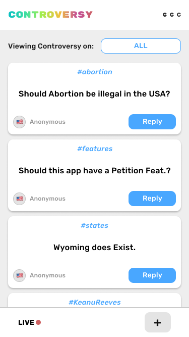

# Project Name
this is the description of the project

**FEATURES**:
- these
- are
- features

## To-do
- [ ] Item to do
- [ ] Item to do
- [ ] Item to do
- [ ] Item to do

## Index

1. [Screen 1](#screen-1-name)
2. [Screen 2](#screen-2-name)
3. [Screen 3](#screen-3-name)

| [Screen 1](#screen-1-name) | [Screen 2](#screen-2-name) | [Screen 3](#screen-3-name) |
| -------------------- | -------------------- | -------------------- |
|  |  |  |

### Screen 1 name
description of screen 1

- this
- is
- the
- screen
- components

### Screen 2 name
description of screen 2

- this
- is
- the
- screen
- components

### Screen 3 name
description of screen 3

- this
- is
- the
- screen
- components